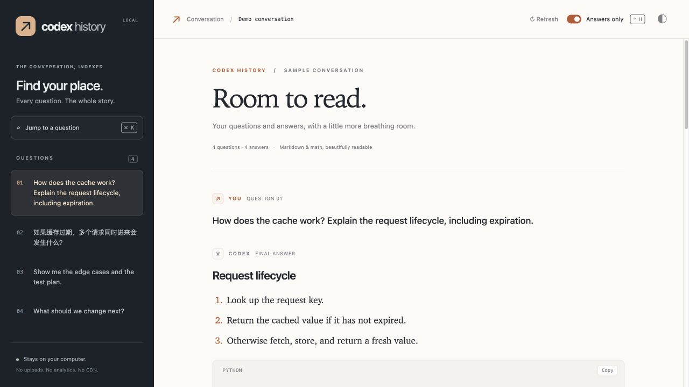
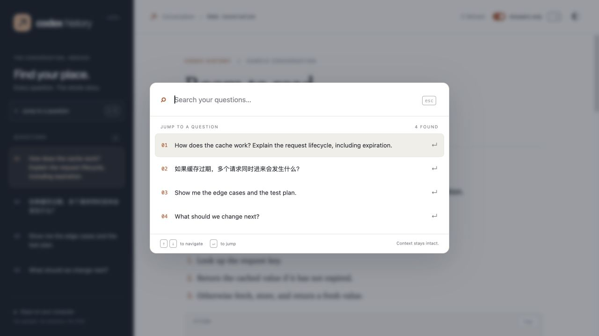
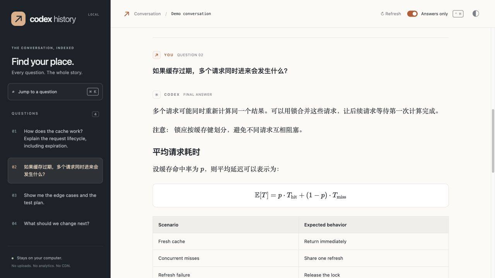
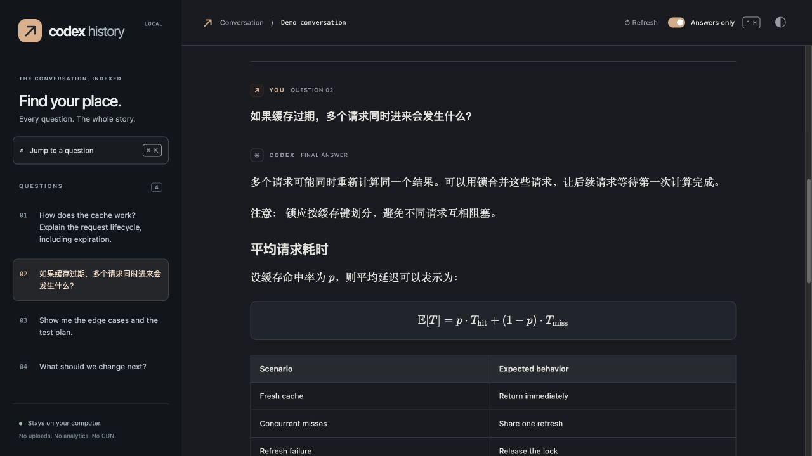

<div align="center">

# ↗ Codex History

### Great answers deserve more than terminal scrollback.

Jump to any question. Keep the context. Give your answers room to breathe.

[](LICENSE)
[](#quick-start)
[](#your-conversation-stays-yours)
[](https://github.com/YijingGuo-June/codex-history/actions/workflows/checks.yml)

**English** · [简体中文](README.zh-CN.md) · [Quick start](#quick-start) · [Troubleshooting](#troubleshooting)



*A local reading companion for Codex. All screenshots use synthetic conversations.*

</div>

You remember asking the question. You remember getting a useful answer. Now it's somewhere above hundreds of lines of progress updates.

**Codex History turns the current conversation into a searchable, readable document.** Pick a question, press Enter, and land at that exact exchange—with everything before and after still there. Read code, tables, and LaTeX properly. Hide the activity when you just want the answer.

## Find the question. Keep the whole story.



Every saved question becomes a navigation point. Search your own words, use **↑ / ↓**, and press **Enter**. This is a jump within the complete conversation: scroll up or down to recover the surrounding context.

| Find it | Read it | Keep it |
| :--- | :--- | :--- |
| Searchable question index | Markdown, tables & highlighted code | Single-file HTML export |
| Keyboard-first jump menu | Inline & display LaTeX | Bundled fonts and rendering assets |
| Continuous conversation | Answers-only view | Offline reading in a browser |
| Exact current-session selection | Light & dark themes | Read-only access to Codex records |

## Math should look like math.



KaTeX renders `$…$`, `$$…$$`, `\(…\)`, and `\[…\]`. Code blocks have syntax highlighting and copy buttons. Tables stay tables. Chinese and English can sit comfortably in the same answer.

<details>
<summary><strong>Late-night reading? See the dark theme.</strong></summary>



</details>

## Quick start

**You need:** a Codex CLI with plugin support, Python **3.9+**, and a modern browser. End users do **not** need `npm install`, pip packages, an API key for the reader, or a CDN. Exported HTML needs only a browser.

```sh
git clone https://github.com/YijingGuo-June/codex-history.git
cd codex-history
codex plugin marketplace add .
codex plugin add codex-history@personal
```

Start a **new Codex session**, then type and select:

```text
$codex-history:history
```

You can also type `$history` and pick this plugin's skill, or find it through `/skills`.

The helper creates an offline HTML snapshot and asks your default browser to open it. If the host blocks browser launching, it returns a link to the generated file. **No listening port or background server is required by default.** Invoke again to include newer messages.

> **What gets installed?** A standard Codex plugin with a skill and a bundled local reader. The viewer opens in your browser. It does not replace the Codex executable or add a native `/history` command. Checked against Codex CLI `0.155.0-alpha.9`.

### Want to try the reader first?

Run this from the cloned repository. It uses **sample data only**:

```sh
python3 plugins/codex-history/scripts/history.py open --demo
```

Or download the repository and open **[demo.html](demo.html)** locally. GitHub's file view shows source; save the file and open it in a browser to use the demo. The file includes its rendering assets and works offline.

### Want to skip the model turn?

`$history` is a skill: Codex uses a model turn to execute its instructions. For a direct local launch, use Codex CLI's **`!` shell mode** instead.

On macOS/Linux, run these once from the repository root:

```sh
mkdir -p "$HOME/.local/bin"
ln -s "$PWD/plugins/codex-history/scripts/history.py" "$HOME/.local/bin/codex-history"
```

Make sure `~/.local/bin` is on your shell's `PATH`, then start Codex and type:

```text
!codex-history
```

This opens the reader without asking a model to run the skill. Codex supplies the current session ID. The shortcut is optional and separate from plugin installation; keep the cloned repository at the same location.

Without setting up a shortcut, the equivalent is `!python3 /absolute/path/to/codex-history/plugins/codex-history/scripts/history.py open`. On Windows, use `py -3` if `python3` is unavailable.

## A few keys are all you need

| Action | Shortcut |
| :--- | :--- |
| Open question picker | **⌘K / Ctrl+K**, or **/** outside an input |
| Choose a question | **↑ / ↓** |
| Jump to the exchange | **Enter** |
| Close picker | **Escape** |
| Toggle activity | **Alt+H**, or **Ctrl+H** where the browser allows it |

The **Answers only** button hides saved reasoning summaries, tool output, and progress messages. Turn it off to inspect the activity again. This changes the reader's presentation, not the original records or Codex's reasoning settings. Browsers can reserve Ctrl+H; the toolbar button is always available.

## Your conversation stays yours

```text
Your Codex session             Codex History                 Your browser
SQLite / rollout JSONL  ──▶  Read-only local helper  ──▶  Offline HTML snapshot
                             exact conversation ID          Markdown · code · math
```

- **Local by default.** The reader has no telemetry, analytics, external rendering service, or network model calls. The `$history` skill itself still uses Codex's normal model workflow.
- **Self-contained rendering.** Fonts and libraries are bundled. Remote images do not load automatically; external links open only when clicked.
- **Read-only source access.** The reader does not modify sessions, migrate databases, or change Codex configuration.
- **Exact session selection.** It uses `CODEX_THREAD_ID`; it never guesses the most recently updated conversation.
- **Private snapshots.** Default exports live in a private temporary directory and contain the conversation. They remain until you or normal temporary-file cleanup remove them. Share them only deliberately.
- **Defensive rendering.** Raw HTML is shown as text, generated Markdown is sanitized, and KaTeX uses `trust: false`. Raw or encrypted reasoning payloads are not displayed.

### Optional live mode

```sh
python3 plugins/codex-history/scripts/history.py open --thread-id UUID --live
```

Live mode detects updates and lets you apply them while preserving your reading position. It binds to **127.0.0.1**, uses a random per-launch access token, checks Host/Origin headers, and expires after two hours. A sandbox may block local server access; the default offline mode avoids that requirement.

## Pick a session or export it

```sh
# A specific conversation
python3 plugins/codex-history/scripts/history.py open --thread-id UUID

# One explicitly chosen legacy rollout file
python3 plugins/codex-history/scripts/history.py open --file /path/to/rollout.jsonl

# Portable HTML; existing files are never overwritten
python3 plugins/codex-history/scripts/history.py export \
  --thread-id UUID --output /path/to/conversation.html
```

`--home` / `CODEX_HOME` select the Codex data directory. `--sqlite-home` supports a custom SQLite location. For SSH sessions, export and copy the HTML to your local machine, or use your existing port forwarding for live mode. The plugin does not create tunnels.

## Troubleshooting

<details>
<summary><strong>“$history has no matches.”</strong></summary>

Use the full name `$codex-history:history`, and restart the CLI after installation. Check the same launcher you use to chat:

```sh
codex plugin list --json
```

If a wrapper uses a separate `CODEX_HOME`, install through that wrapper. For example, from this repository:

```sh
codex-jd plugin marketplace add .
codex-jd plugin add codex-history@personal
```

An installation in one Codex home is not automatically shared with another.

</details>

<details>
<summary><strong>“The skill starts chatting instead of instantly opening a window.”</strong></summary>

Skills run through the model. The installed skill tells it to execute the bundled helper and return the file link. Browser launching can still be blocked by the host; in that case open the returned HTML file yourself. Use the optional `!codex-history` shortcut above when you want to bypass the model turn.

</details>

<details>
<summary><strong>“I already have a marketplace named personal.”</strong></summary>

This repository retains its original `personal` marketplace name. If a different marketplace already uses it, assign this clone a unique name in `.agents/plugins/marketplace.json` before registering it, and use that name after `@` when installing. Do not remove your existing marketplace just to install this plugin.

</details>

<details>
<summary><strong>“Can it add /history or jump inside the terminal?”</strong></summary>

The checked Codex version does not expose plugin registration for native slash commands or terminal transcript scrolling. The question picker and jumps therefore live in the browser companion. A native version needs upstream extension support or a maintained CLI fork.

</details>

<details>
<summary><strong>“Some messages or attachments look different.”</strong></summary>

Codex storage schemas are not a permanent public API. The reader prefers SQLite and supports legacy JSONL, including duplicate event handling and a partially written final line. An active conversation can have questions without saved final answers. Older records without assistant phase metadata cannot reliably distinguish every progress update from an answer. Image attachments appear as placeholders; this is a text, code, and math reader.

</details>

## Build with us

The runtime is **Python's standard library + static web assets**. JavaScript dependencies are pinned and vendored; npm is only needed when rebuilding those assets.

```sh
python3 -m unittest discover -s tests -v
node --check plugins/codex-history/assets/viewer.js

# Only when updating bundled rendering libraries
npm ci --ignore-scripts
npm run vendor
```

CI runs the runtime suite on Linux, macOS, and Windows. Tests cover record parsing, session selection, snapshot generation, script escaping, browser-launch failure, and live-server access controls.

Useful contributions: compatibility fixtures for new Codex schemas, accessibility improvements, long-conversation performance, and better installation ergonomics. See [CONTRIBUTING.md](CONTRIBUTING.md). Please use synthetic data in reports and pull requests.

If this saves you a trip through terminal scrollback, a **star** helps other Codex users find it.

---

[MIT](LICENSE) · [Third-party notices](THIRD_PARTY_NOTICES.md) · An independent community project, not affiliated with or endorsed by OpenAI.
